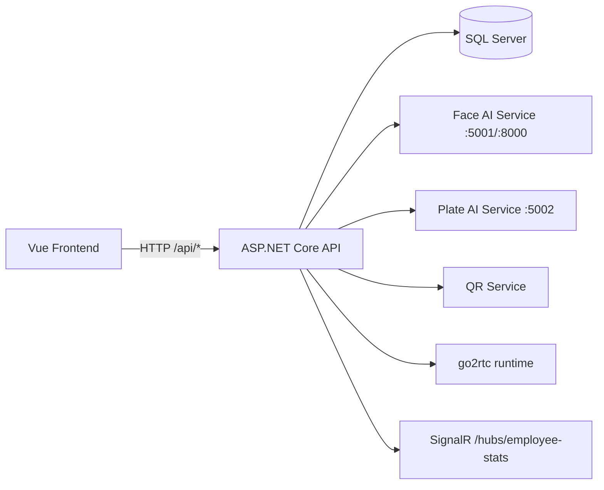

# V-Shield-2.0 - Master Rename Map & Refactor Safety Plan

## 0) Scope and invariants
- Project name is fixed: `V-Shield-2.0`.
- Protected folders inside `AI_Project`: `test`, `cam`.
- This document does **not** propose renaming `test` or `cam`.
- Analysis-only execution: no source modification was performed.
- Full scan scope: 232 source/runtime/config files (excluding `node_modules`, `venv`, `bin`, `obj`, media/model binaries).

## 1) Architecture Overview
### 1.1 Folder structure (runtime-relevant)
- `API/API/API`: ASP.NET Core 8 Web API + EF Core + JWT + SignalR
- `View`: Vue 3 + Vite frontend
- `AI_Project`:
  - `face_recognition`: Python FaceID service
  - `doc_bien_gpu`: Python plate recognition service
  - `QR_Dong`: Python dynamic QR service
  - `AI_An_Ninh`: Python AI security app
  - `test`, `cam`: protected folders (kept as-is)
- Root SQL seed/data script: `AccessControlDB_HoanChinh.sql`

### 1.2 Layer architecture
- Presentation: Vue pages/components (`View/src/pages`, `View/src/components`)
- API layer: Controllers (`API/.../Controllers`)
- Domain/data layer: Models + `ApplicationDbContext`
- Service layer: `AuthService`, `VehicleService`, runtime orchestrator services
- External AI runtimes: Python HTTP services (`5001`, `5002`, `8000`)
- Persistence: SQL Server via EF Core + seed SQL script

### 1.3 Dependency graph

### 1.4 Main execution flow
- API bootstrap in `Program.cs`: DI, auth, CORS, controllers, hub, `/health`, runtime auto-start.
- Frontend bootstraps router and service clients from `View/src/config/api.js`.
- Runtime control endpoints (`SetCamController`, `FaceIDController`, `RuntimeServicesController`) orchestrate Python/go2rtc processes.

## 2) Current Naming Convention Assessment
### 2.1 Observed conventions
- C# backend: mostly PascalCase for types/properties, camelCase for locals/params.
- Vue/JS: mixed camelCase and PascalCase; route `name` has mixed patterns (`Dashboard`, `tao_qr_d`, `bienso`, `FaceID`).
- Python: snake_case dominant but mixed with domain Vietnamese terms.
- API routes: mixed English + Vietnamese transliteration (`BienSo`, `ThongHanh`, `QR_Dong`).

### 2.2 Inconsistencies and risk hot spots
- Mixed-language naming (English + Vietnamese) across controller/service/page/component names.
- Mixed casing/format in route names (`FaceID`, `tao_qr_d`, `QrAccessMonitor`).
- Acronym style inconsistency (`QR_Dong`, `FaceID`, `API_BASE_URL`).
- Dynamic strings and hardcoded paths in runtime orchestration.
- Encoding/mojibake traces in comments and literals in several C# files.

### 2.3 Hidden linkage categories detected
- Route attributes and conventional route tokens (`[Route("api/[controller]")]`)
- DI registrations (`AddScoped`, `AddSingleton`, `AddHostedService`)
- EF mappings (`DbSet`, `HasConstraintName`, FK relationships)
- JSON/config keys (`appsettings*.json`, API responses, frontend parsing)
- Runtime process and file path references (`go2rtc`, `AI_Project/...`)
- HTTP cross-service references (`AiServices` base URLs)
- Frontend router names/paths + sidebar/menu path duplication
- SQL table/column/status values in script and code

## 3) Dependency & Linkage Inventory (Generated)
Generated artifacts (full machine-readable master map):
- `analysis_source_files.txt`
- `analysis_tree.txt`
- `analysis_name_declarations.csv` (all extracted declarations/keys/selectors)
- `analysis_symbol_references_clean.csv` (cross-file symbol reference counts + sample refs)
- `analysis_master_map_seed.csv` (seed risk classification per item)
- `analysis_api_routes.txt`
- `analysis_frontend_routes_services.txt`
- `analysis_ai_coupling.txt`
- `analysis_sql_objects.txt`

These files are the authoritative full inventory for bulk-safe rename planning.

## 4) Master Rename Policy (Safe Refactor Rules)
### 4.1 Absolute no-touch by rule
- Project name: `V-Shield-2.0`
- Folders: `AI_Project/test`, `AI_Project/cam`

### 4.2 Critical rename classes
- API routes, HTTP attributes, hub paths
- JSON request/response fields and config keys
- EF entity/table/column mapping names and FK constraint names
- SQL script table/column/status literals
- Runtime string selectors: process names, file paths, endpoint URLs

### 4.3 Risk scoring model
- `Critical`: breaks contract/runtime immediately (routes, JSON keys, DB mapping, config keys, hardcoded path/runtime token).
- `High Risk`: cross-layer type/namespace/controller/service names with many references.
- `Medium Risk`: internal methods/properties with moderate fan-out.
- `Safe`: low fan-out local/internal symbols.

## 5) High-Priority Rename Candidates (Representative)
Note: Full list is in `analysis_master_map_seed.csv` + `analysis_symbol_references_clean.csv`.

| Current Name | Type | Location | Key Dependencies | Risk | Suggested English Name | Reason |
|---|---|---|---|---|---|---|
| `BienSoController` | C# class/controller | `API/.../Controllers/BienSoController.cs` | FE service `biensoApi.js`, route `/api/BienSo/*` | Critical | `LicensePlateController` | Vietnamese transliteration; API contract impact |
| `ThongHanhController` | C# class/controller | `API/.../Controllers/ThongHanhController.cs` | FE `thonghanhAPI.js`, route `/api/ThongHanh/*` | Critical | `GateTransitController` | Mixed-language semantic ambiguity |
| `QR_DongController` | C# class/controller | `API/.../Controllers/QR_DongController.cs` | FE `qr_dAPI.js`, route `/api/QR_Dong/*` | Critical | `DynamicQrController` | Underscore + mixed language |
| `setcamAPI.js` | JS file/service | `View/src/services/setcamAPI.js` | `SetCamController` endpoints | High Risk | `cameraRuntimeApi.js` | unclear intent + mixed casing |
| Route name `tao_qr_d` | Vue route name | `View/src/router/index.js` | router guards/navigation/sidebar | Critical | `createDynamicQr` | snake_case outlier in router namespace |
| Route name `scan_qr_d` | Vue route name | `View/src/router/index.js` | router guards/navigation/sidebar | Critical | `scanDynamicQr` | naming inconsistency |
| Component `BienSoSecurity` | Vue component | `View/src/components/BienSoSecurity.vue` | route `bienso`, API `/BienSo` | High Risk | `LicensePlateSecurity` | mixed language |
| `EmployeeDynamicQrs` | DbSet/property | `ApplicationDbContext.cs` | EF queries/controllers/services | High Risk | keep plural but standardize `EmployeeDynamicQRCodes` | acronym consistency |
| `FaceIDController` | C# class/controller | `API/.../Controllers/FaceIDController.cs` | FE `faceApi.js`, runtime services | High Risk | `FaceIdController` | acronym casing consistency |
| `API` namespace root | C# namespace | many backend files | all backend compile references | High Risk | keep or migrate carefully to `VShield.Api` | broad compile impact |

## 6) Contract-Sensitive Link Maps
### 6.1 API routes
Complete route list with line numbers: `analysis_api_routes.txt`.
Includes all controllers and key mapped endpoints (`/hubs/employee-stats`, `/health`).

### 6.2 Frontend route/service coupling
Complete FE route + API client base URLs: `analysis_frontend_routes_services.txt`.
Key coupling files:
- `View/src/router/index.js`
- `View/src/services/*.js`
- `View/src/components/Layout/Sidebar.vue`
- `View/src/config/api.js`

### 6.3 Config and environment keys
Primary keys (backend):
- `ConnectionStrings:DefaultConnection`
- `JwtSettings:*`
- `SeedAdmin:*`
- `AiServices:*`
- `AppSettings:*`
- `Cloudflared:*`

### 6.4 Database map
- EF map source: `API/.../Data/ApplicationDbContext.cs`
- SQL script object usage: `analysis_sql_objects.txt`
- Naming sensitivity: `DbSet`, FK names, status literals (`IN`, `OUT`, `PENDING`, etc.)

## 7) Refactor Plan (Phased, Safe)
1. Freeze contracts
- Freeze route names, JSON keys, DB column/table names as baseline.
- Snapshot generated inventories (`analysis_*.csv/txt`).

2. Internal symbol standardization first
- Rename low-risk internal methods/properties/classes without API/DB contract exposure.
- Rebuild after each logical batch.

3. Cross-layer bilingual normalization
- Introduce English aliases/adapters first (dual support), then deprecate old names.
- Apply to controller names/routes only with FE coordinated changes.

4. Contract migrations (if needed)
- API route migration via versioning or temporary dual routes.
- JSON key migration using backward-compatible DTO fields.
- DB rename only via EF migration + SQL migration script + data validation.

5. Runtime string/path hardening
- Replace hardcoded process/path tokens with centralized constants/options.
- Validate go2rtc/AI paths and service URLs per environment.

## 8) Naming Standard Target (Recommended)
- C#: Microsoft/.NET conventions (PascalCase types/members, camelCase locals, `I*` interfaces, async suffix `Async`).
- JS/Vue: camelCase vars/functions, PascalCase components, kebab-case URL paths, stable route names in lowerCamelCase.
- Python: PEP8 snake_case.
- Avoid mixed-language identifiers for code symbols; keep Vietnamese in user-facing content only.

## 9) Required Validation Checklist Before Any Rename Batch
- Compile API (`dotnet build`) and run smoke tests.
- Validate all routes from `analysis_api_routes.txt`.
- Validate frontend navigation paths and route-name navigation.
- Validate AI runtime calls and process control endpoints.
- Validate serialization/deserialization for DTOs and appsettings keys.
- Validate EF mappings and SQL integration.

## 10) Completion Notes
- Full-project scan completed for runtime/code/config scope.
- Master rename map is delivered as this document + generated CSV/TXT appendices.
- No code changes were performed.
